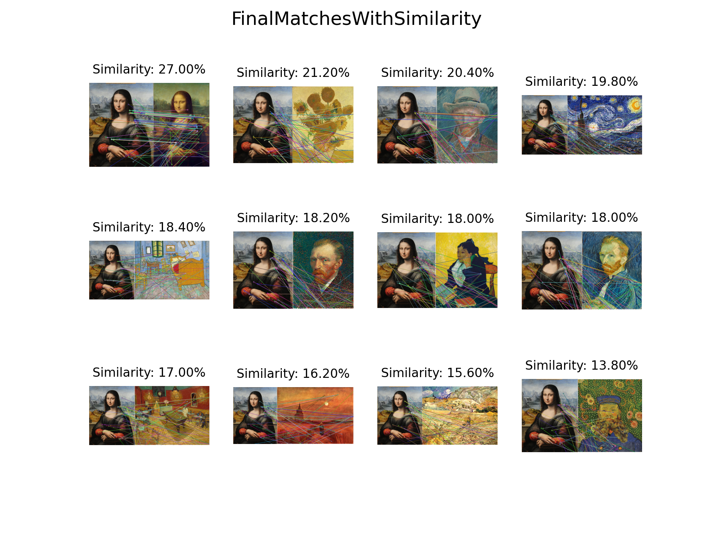

# 图像相似度评估

 

本仓库提供基于ORB特征点的图像相似度估计。

## 技术路线图


## 依赖

+ python 3.7.16

+ numpy 1.21.6

+ opencv-python 4.7.0.72

+ matplotlib 3.5.3

+ pyinstaller 5.9.0

> 测试平台：Window10 x86_64

## 结果

### 样本图片

|sample1|sample2|sample3|sample4|
|---|---|---|---|
|||||

### 查询图片

|col1|col2|col3|col4
|---|---|---|---|
|||||
|||||
|||||

### 结果与保存

> 以sample4为例

+ 匹配图



+ 关键点


+ 最佳匹配

|sample|query|simlarity(%)|
|---|---|---|
|||27.00|

+ 结果保存在指定的输出路径中，结构如下：

```text
├─descriptors
├─keypoints
└─resize
```

## 用法

拥有python运行环境，推荐`py脚本`方式，否则推荐`exe`方式

### 使用脚本

+ 终端/cmd进入项目目录后执行：

```bat
python .\main.py -s .\data\sample\sample4.png -q .\data\query\ -o .\output\
```

+ 查看帮助：

```bat
.\main.py -h
```

### 使用exe

+ 终端/cmd进入app目录执行:

```bat
.\imageSim.exe -s ..\data\sample\sample4.png -q ..\data\query\ -o ..\output\
```

或者直接根目录下运行`run.bat`文件

```bat
.\run.bat
```

> 或者直接**双击运行**

## 使用pyinstaller封装py脚本（可选）

若需要修改py脚本文件，再次封装是，需要使用pyinstaller包

[pyinstaller文档](https://pyinstaller.org/en/stable/index.html)

修改完成后直接运行`createEXE.bat`文件即可在py脚本所在目录生成`app`文件夹，exe文件存放在`app`中

## 感谢

本项目参考了[SIFTImageSimilarity](https://github.com/adumrewal/SIFTImageSimilarity)和[Feature-Detection-and-Matching](https://github.com/whoisraibolt/Feature-Detection-and-Matching)感谢他们优秀的工作。