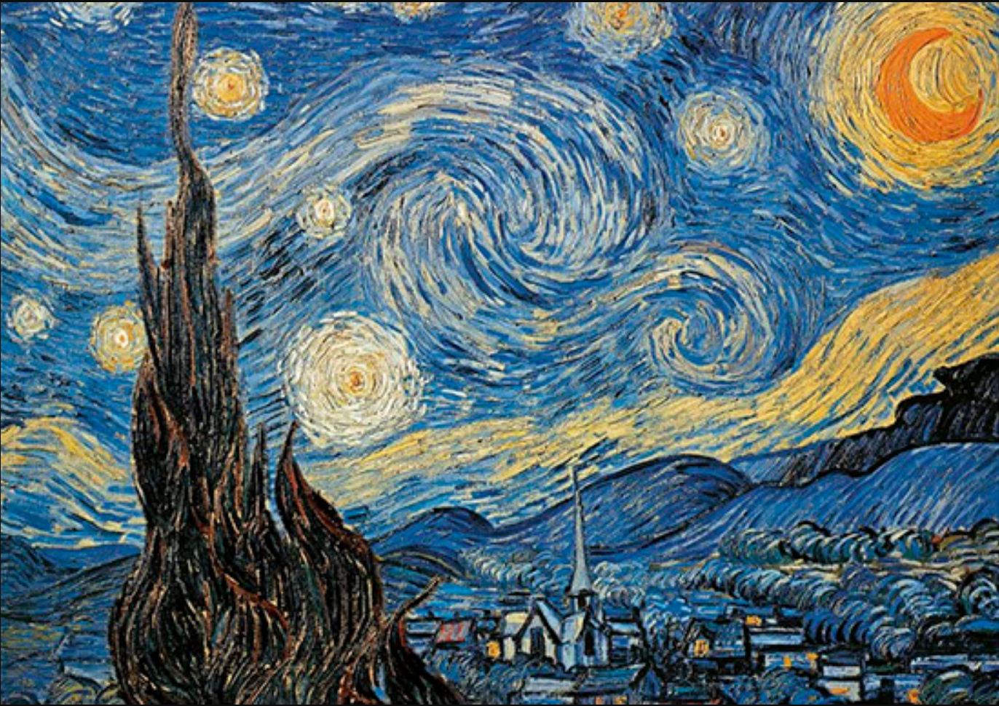
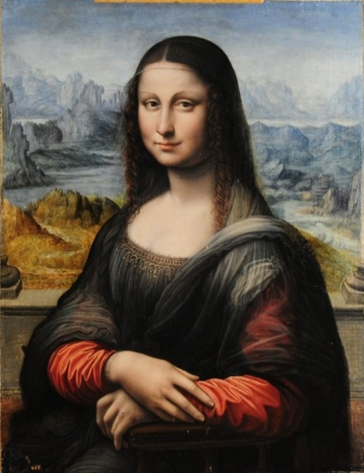
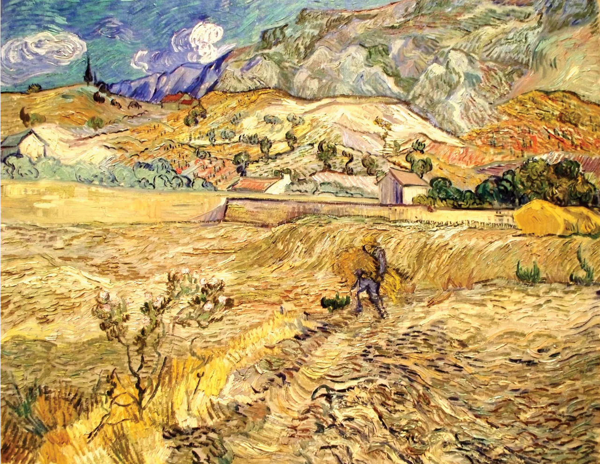
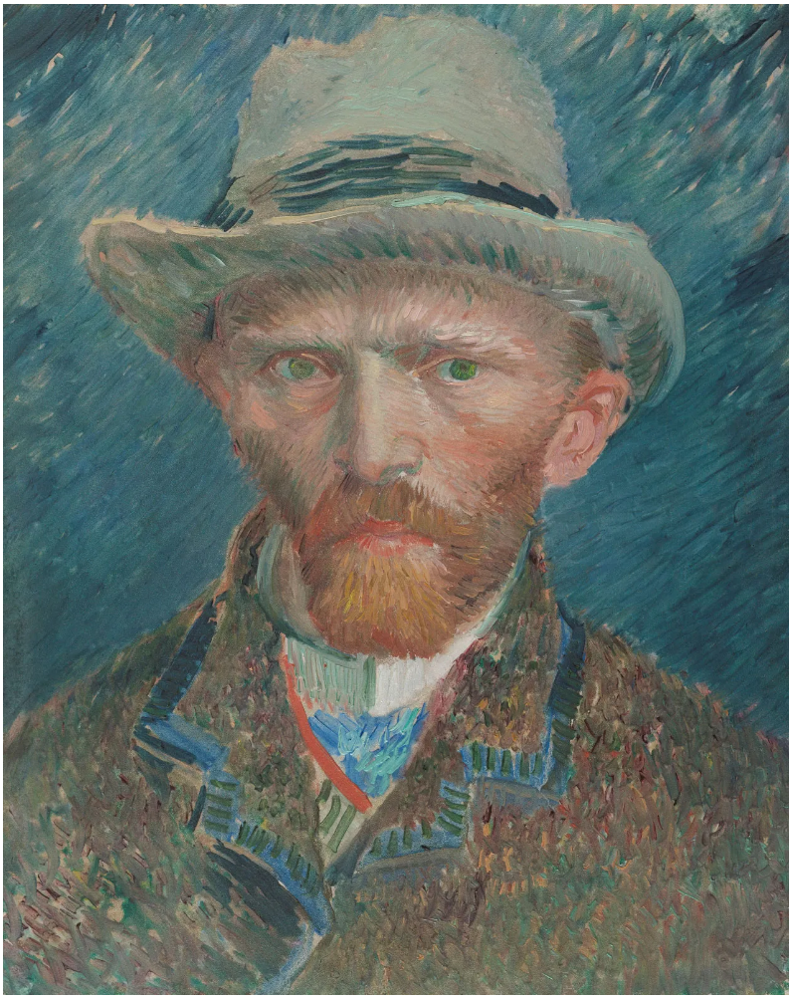
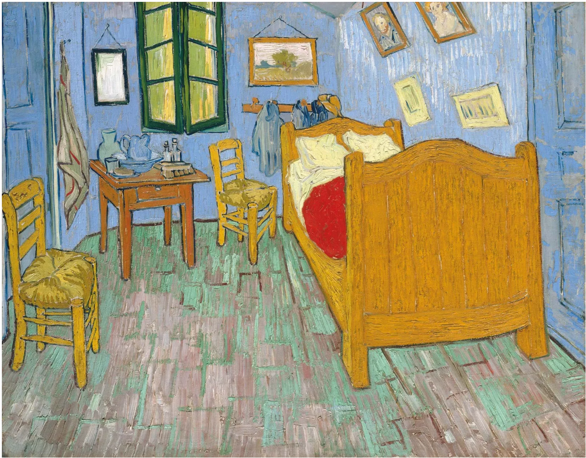
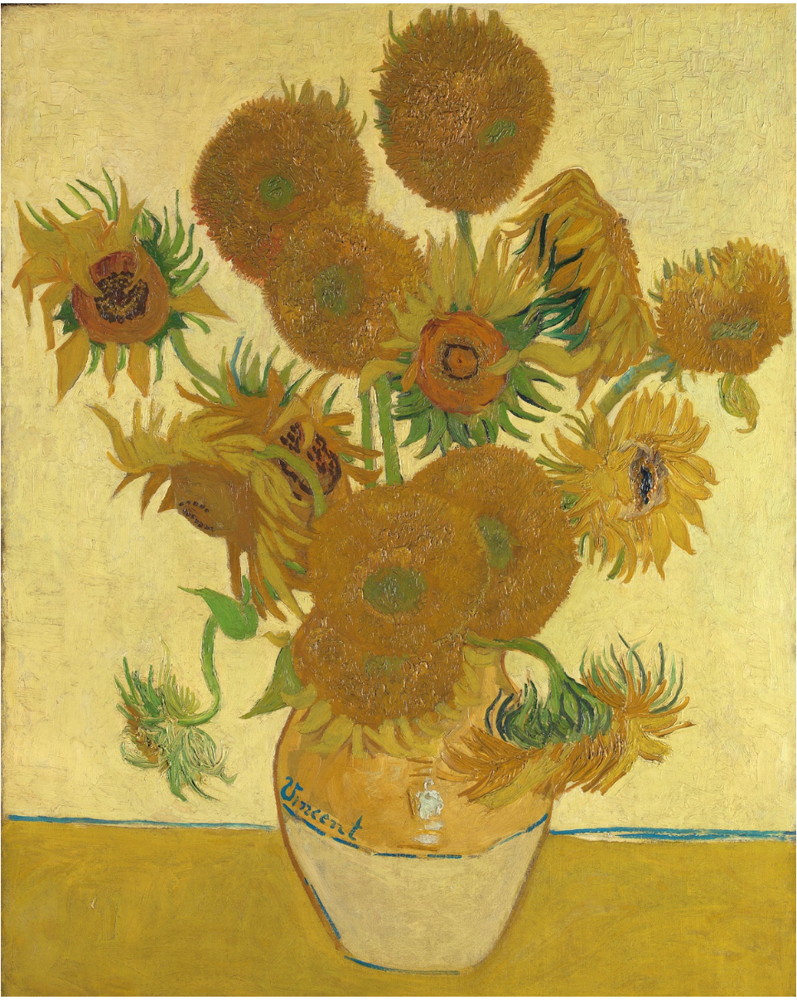
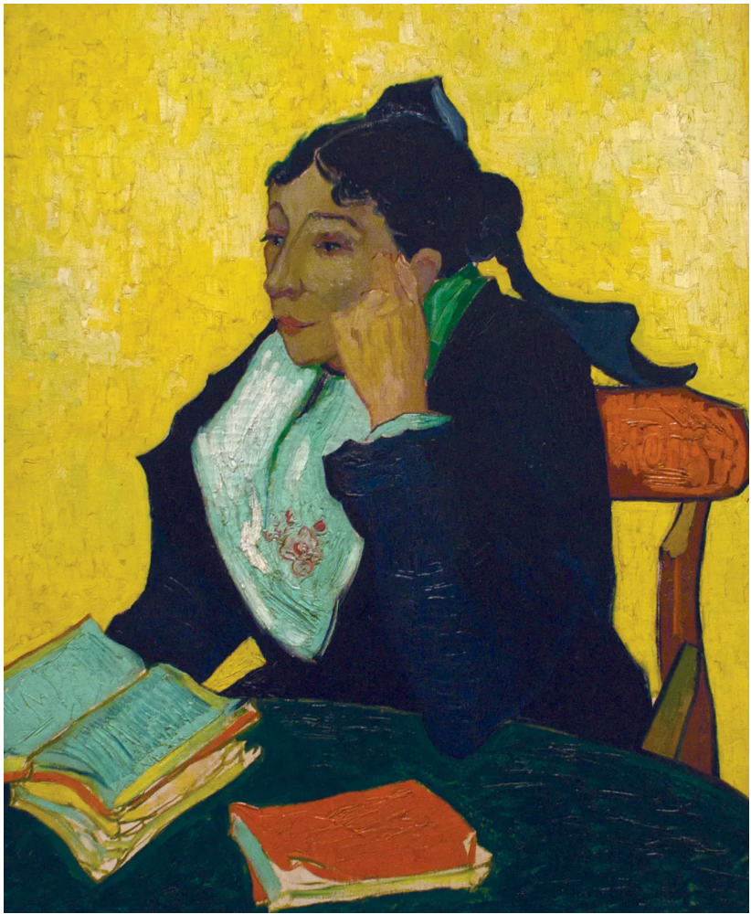
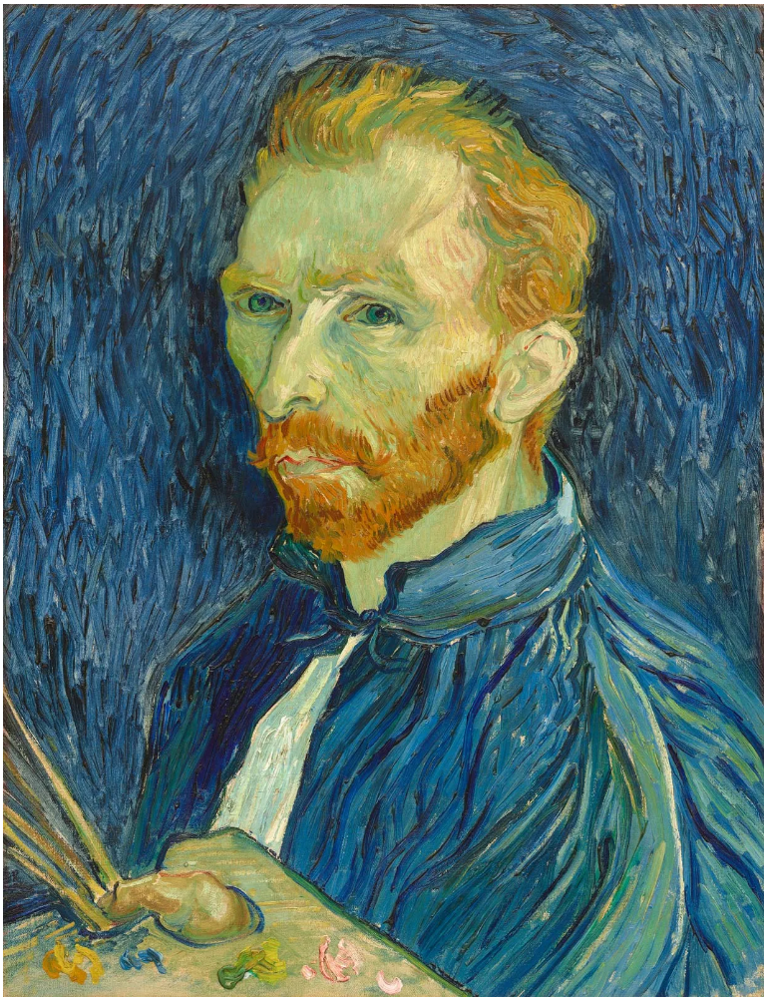
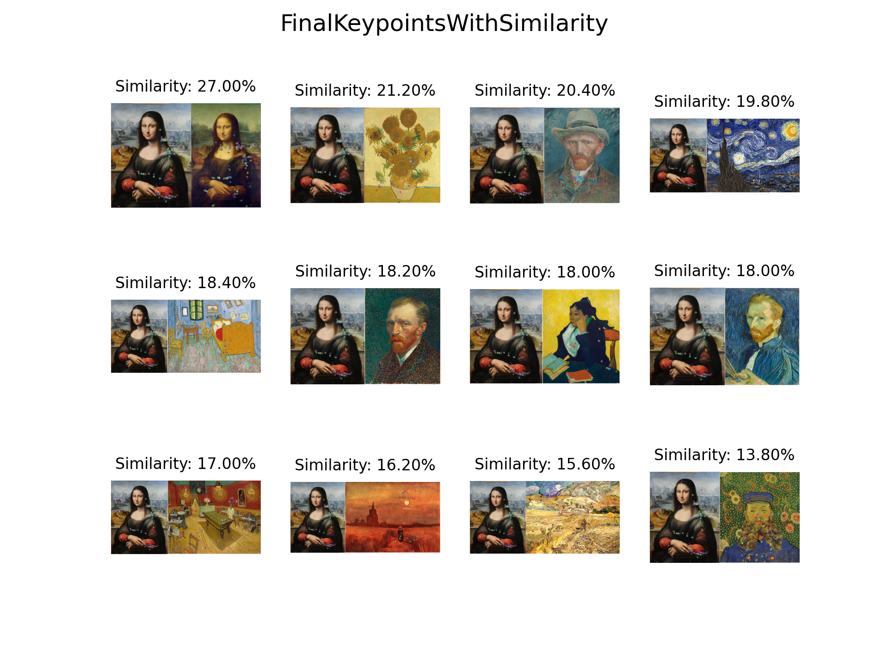

# Image similarity estimation

 

本仓库提供基于ORB特征点的图像相似度估计。

English|[中文](./README.md)

## Roadmap


## Dependency

+ python 3.7.16

+ numpy 1.21.6

+ opencv-python 4.7.0.72

+ matplotlib 3.5.3

+ pyinstaller 5.9.0

> test platform：Window10 x86_64

## Results

### sample image

|sample1|sample2|sample3|sample4|
|---|---|---|---|
|||||

### query image

|col1|col2|col3|col4
|---|---|---|---|
|||||
|||||
|||||

### 结果与保存

> Take sample4 as an example

+ matches


+ keypoints



+ best match

|sample|query|simlarity(%)|
|---|---|---|
|||27.00|

+ The result is saved in the specified output path with the following structure:

```text
├─descriptors
├─keypoints
└─resize
```

## Usage

If you already have python enviroment， run by `py script` is recommended，otherwise run by `exe` is recommend.

### using py scripts

+ terminal/cmd navigate into project directory, then execute：

```bat
python .\main.py -s .\data\sample\sample4.png -q .\data\query\ -o .\output\
```

+ check help：

```bat
.\main.py -h
```

### using exe

+ terminal/cmd navigate into `app` and execute:

```bat
.\imageSim.exe -s ..\data\sample\sample4.png -q ..\data\query\ -o ..\output\
```

or directly run `run.bat` in terminal/cmd

```bat
.\run.bat
```

## Package py scripts using pyinstaller（optional）

If you need to modify the py script file, you need to use the pyinstaller package when packaging it again.

[pyinstaller docs](https://pyinstaller.org/en/stable/index.html)

After modification, run the 'createEXE.bat' file directly to generate the 'app' folder in the directory where the py script is located. The exe file is stored in 'app'.

## Acknowledgements

Thanks to adumrewal and whoisraibolt for opening source of their excellent work [SIFTImageSimilarity](https://github.com/adumrewal/SIFTImageSimilarity)and [Feature-Detection-and-Matching](https://github.com/whoisraibolt/Feature-Detection-and-Matching).